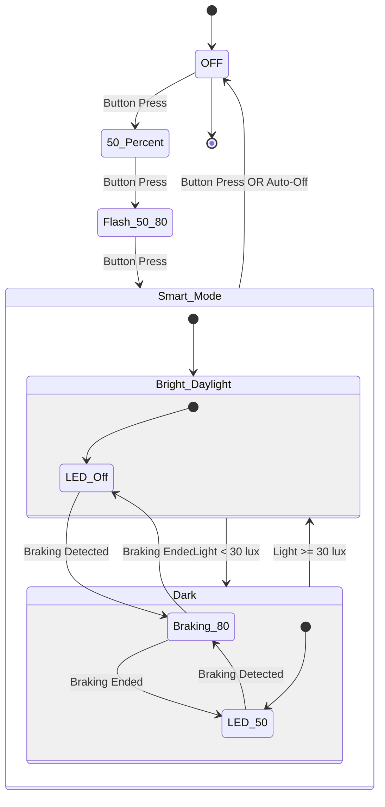

# Bike Light Rear - User Manual

## Overview

The bike light rear is a high-visibility intelligent bicycle tail light featuring four operating modes, smart braking detection, ambient light sensing, and automatic power-saving functionality.

## Operating Modes

The light cycles through four modes via button press, returning to OFF after the last mode:

```
OFF → 50% → 50/80 Flash → Smart Mode → OFF
```

### Mode 1: OFF
- **Description**: Light is completely off
- **Power Consumption**: Minimal (sensor monitoring continues)
- **Activation**: Press button from Smart Mode

### Mode 2: 50% Continuous
- **Description**: Steady illumination at 50% brightness
- **PWM Frequency**: 1 kHz
- **Duty Cycle**: 50% (500µs pulse width)
- **Use Case**: General visibility in moderate traffic
- **Activation**: Press button from OFF mode

### Mode 3: 50/80 Flash (High Visibility)
- **Description**: Enhanced visibility mode with periodic brightness flashes
- **Base Brightness**: 50% continuous
- **Flash Pattern**: 80% brightness flash for 100ms every 1.5 seconds
- **PWM Frequency**: 1 kHz
- **Use Case**: High-traffic environments, increased attention-grabbing
- **Activation**: Press button from 50% mode

### Mode 4: Smart Mode (Adaptive)
- **Description**: Intelligent adaptive lighting based on environmental conditions and rider behavior
- **Features**:
  - Automatic braking detection
  - Ambient light sensing
  - Automatic power-off when stationary
- **Activation**: Press button from 50/80 Flash mode
- **See detailed behavior below**

## Smart Mode Detailed Behavior

Smart Mode adapts LED brightness based on three environmental factors:

### 1. Braking Detection

**Detection Criteria:**
- Z-axis acceleration < -3.0 m/s² for **2 consecutive samples** (1 second total)
- Rear-facing sensor orientation: negative Z indicates deceleration

**Behavior When Braking:**
- LED immediately switches to **80% brightness** (800µs PWM)
- Overrides ambient light settings
- Previous brightness state is saved

**Braking End Detection:**
- Z-axis acceleration returns above -3.0 m/s² for **2 consecutive samples**
- LED returns to previous brightness state (based on ambient light)

### 2. Ambient Light Control

**Darkness Threshold:** < 50 lux

### 3. Automatic Power-Off

**Stationary Detection:**
- Monitors acceleration magnitude: √(x² + y² + z²)
- Expected value when stationary: ~9.81 m/s² (Earth's gravity)
- Tolerance: ±10% (8.829 - 10.791 m/s²)

**Auto-Off Criteria:**
- ALL of the last **300 samples** (2.5 minutes) must be within stationary range
- Check performed every 60 seconds (energy efficient)
- Only activates if currently in Smart Mode

**When Auto-Off Triggers:**
- Light switches to OFF mode
- Requires manual button press to reactivate

## Technical Specifications

### Sensor System

**Accelerometer (LIS3DH):**
- 3-axis motion detection
- Sampling Rate: 500ms (2 Hz)
- Range: ±2g typical
- Interface: I²C

**Light Sensor (OPT3001):**
- Range: 0.01 - 83,000 lux
- Human-eye spectral matching
- Sampling Rate: 500ms (2 Hz)
- Interface: I²C

**Temperature Sensor:**
- Internal nRF52833 die temperature
- Used for system monitoring

### Data Buffer

**Circular Buffer:**
- Size: 360 samples
- Duration: 3 minutes of history
- Sampling Period: 500ms
- Thread Safety: Zephyr read-write lock (`sys_rwlock`)
- Stored Data: Temperature, ambient light, acceleration (X, Y, Z)

**Buffer Management:**
- Continuous overwrite (oldest data replaced)
- Thread-safe concurrent access
- Separate reader/writer threads

### LED Driver

**LED Specifications:**
- Type: Cree XP-E2 Red (625nm)
- Drive Current: 500mA
- Driver: PAM2804 constant-current step-down

**PWM Control:**
- Frequency: 1 kHz (1000µs period)
- Resolution: 1µs
- Brightness Levels:
  - 0%: 0µs pulse width (OFF)
  - 50%: 500µs pulse width
  - 80%: 800µs pulse width

### Power Management

**Battery:**
- Type: Single 18350 Li-ion cell
- Capacity: 1100mAh (Vapcell)
- Operating Range: 3.11V - 4.2V

**System Voltage:**
- Regulated: 2.7V (NPM1100 buck regulator)
- Efficiency: 90-95% battery utilization

**Protection:**
- Over-voltage: 4.3V cutoff
- Under-voltage: 2.5V cutoff (DW01A protection IC)
- Over-current: >2A protection

## State Transition Diagram



## Usage Recommendations

### Daytime Riding
- Use **50/80 Flash** mode for maximum visibility in bright conditions
- Or use **Smart Mode** which will activate only during braking

### Night Riding
- Use **50% Continuous** for steady visibility
- Or use **Smart Mode** which provides 50% baseline with braking boost

### Commuting
- **Smart Mode** is ideal for mixed urban/traffic conditions
- Automatic brightness adjustment reduces manual intervention
- Auto-off prevents battery drain if bike is left stationary

### Long-Term Storage
- Switch to **OFF mode** to minimize power consumption
- Charge battery to ~50% for optimal storage
- Disconnect battery if storing for extended periods (>3 months)

## Troubleshooting

### Light doesn't turn on
- Check battery charge level
- Verify battery protection circuit hasn't tripped (cycle charge)
- Ensure firmware is loaded correctly

### Smart Mode not responding to braking
- Verify accelerometer orientation (Z-axis must face rear)
- Check sensor I²C connection (use DEBUG mode)
- Confirm sampling period is 500ms

### Premature auto-off in Smart Mode
- May indicate excessive vibration/noise in accelerometer
- Try adjusting stationary threshold tolerance
- Verify sensor mounting is secure

### LED flickers in Smart Mode
- Normal during rapid ambient light changes
- May indicate marginal light threshold (~30 lux)
- Consider adjusting AMBIENT_DARK_THRESHOLD

## Firmware Information

**Build System:** nRF Connect SDK v3.1.1  
**Target Device:** Nordic nRF52833 (BL653 module)  
**RTOS:** Zephyr OS  
**Programming Interface:** SWD (Serial Wire Debug)

**Thread Architecture:**
- Main Thread: Button handling, system coordination
- Sensor Thread: 500ms sampling, environmental state updates
- Stationary Monitor: 60s periodic checks, auto-off logic
- Button ISR: Debounced input with callback

**Key Configuration Options:**
- `BRAKING_ACCEL_THRESHOLD`: -2.0 m/s² (in `sensor_data_collector.c`)
- `AMBIENT_DARK_THRESHOLD`: 30.0 lux (in `sensor_data_collector.c`)
- `SENSOR_BUFFER_SIZE`: 360 samples (in `sensor_data_collector.h`)
- `TIME_SAMPLING_INTERVAL_MS`: 500ms (in `sensor_data_collector.c`)

## Safety Notes

- This light is designed as a supplementary safety device
- Always use in conjunction with other bicycle lighting
- Ensure light is securely mounted to prevent detachment
- Regularly inspect mounting hardware for wear
- Replace battery according to manufacturer specifications
- Do not attempt to charge damaged or swollen batteries

## Compliance

**Electrical Safety:** Designed for low-voltage DC operation (3.0-4.2V)  
**EMC:** Bluetooth 5.1 compliant (2.4GHz ISM band)  
**Environmental:** Not waterproof - use in dry conditions or with protective cover

## License

Copyright © 2025 Matthias Dippold

This firmware is released under **GPLv3 + NonCommercial**.  
See LICENSE file for complete terms.

---

**Firmware Version:** 1.0.0 (Smart Mode Release)  
**Last Updated:** December 2025  
**For support and updates:** See main README.md

