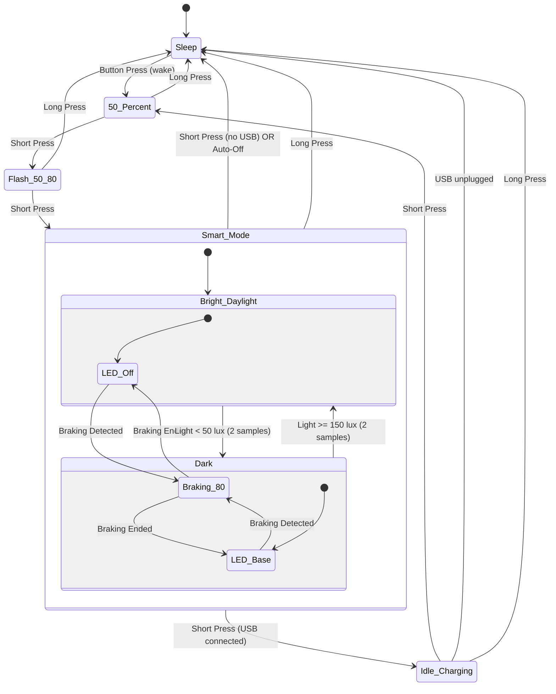

# Bike Light Rear - User Manual

## Overview

The bike light rear is a high-visibility intelligent bicycle tail light featuring four operating modes, smart braking detection, ambient light sensing, and automatic power-saving functionality.

## Operating Modes

The light cycles through its modes via short button press:

```
OFF → 50% → 50/80 Flash → Smart Mode → OFF (deep sleep)
```

### Mode 1: OFF
- **Description**: Light is completely off; the device is in deep sleep (System OFF)
- **Power Consumption**: Minimal (only the button wake circuit is active)
- **Wake**: Press the button to wake; the light starts in 50% Continuous

### Mode 2: 50% Continuous
- **Description**: Steady illumination at base brightness
- **PWM Frequency**: 1 kHz
- **Duty Cycle**: 20% (200µs pulse width)
- **Use Case**: General visibility in moderate traffic
- **Activation**: Press button from OFF mode

### Mode 3: 50/80 Flash (High Visibility)
- **Description**: Enhanced visibility mode with a periodic double flash
- **Base Brightness**: 200µs pulse width, continuous
- **Flash Pattern**: Double flash every 1.5 seconds - 80% (800µs) for 70ms, base for 70ms, 80% for 70ms, then back to base
- **PWM Frequency**: 1 kHz
- **Use Case**: High-traffic environments, increased attention-grabbing
- **Activation**: Press button from 50% mode

### Mode 4: Smart Mode (Adaptive)
- **Description**: Intelligent adaptive lighting based on environmental conditions and rider behavior
- **Features**:
  - Automatic braking detection
  - Ambient light sensing
  - Automatic power-off when stationary
- **Activation**: Press button from 50/80 Flash mode
- **See detailed behavior below**

### Button behavior summary

- **Short press** (released within 1 second):
  - Cycles modes: `OFF → 50% → 50/80 Flash → Smart Mode → OFF`
  - When USB is connected, Smart Mode advances to **IDLE_CHARGING** instead of powering off; another short press turns the light back on at 50%.
- **Long press** (held for 1 second or longer):
  - Turns the light **off immediately from any mode** and enters deep sleep.
- **Wake from sleep**:
  - After the light has turned itself fully off and entered deep sleep, a press wakes it and starts at 50% continuous.

## Smart Mode Detailed Behavior

Smart Mode adapts LED brightness based on three environmental factors.
Brightness priority: **Braking (80%) > Darkness (base) > Off**.

### 1. Braking Detection

**Detection Criteria:**
- Z-axis acceleration < -3.0 m/s² for **2 consecutive samples** (1 second total)
- Rear-facing sensor orientation: negative Z indicates deceleration

**Behavior When Braking:**
- LED immediately switches to **80% brightness** (800µs PWM)
- Overrides ambient light settings

**Braking End Detection:**
- Z-axis acceleration returns above -3.0 m/s² for **2 consecutive samples**
- LED returns to the brightness dictated by ambient light

### 2. Ambient Light Control

- **Darkness threshold**: < 50 lux for 2 consecutive samples → LED at base brightness
- **Brightness threshold**: ≥ 150 lux for 2 consecutive samples → LED off (hysteresis prevents flicker from the light's own output)

### 3. Automatic Power-Off

**Stationary Detection:**
- Monitors acceleration magnitude: √(x² + y² + z²)
- Expected value when stationary: ~9.81 m/s² (Earth's gravity)
- Tolerance: ±10% (8.829 - 10.791 m/s²)

**Auto-Off Criteria:**
- **300 consecutive samples** (2.5 minutes at 500ms sampling) within the stationary range
- Any movement resets the counter
- Only active in Smart Mode

**When Auto-Off Triggers:**
- Light switches off and enters deep sleep to save battery.
- Requires a manual button press to wake and reactivate (starts in 50% continuous).

## Charging & Battery Behavior

### Normal charging

- **USB-C port** on the light is used for charging the 18350 cell.
- Powering up with **USB plugged in** boots the light into **IDLE_CHARGING** (main LED off).
- While USB is connected, the **status LED blinks fast (300ms)** to show charging activity.
- **Unplugging USB** while in IDLE_CHARGING powers the light off (deep sleep); press the button to turn it back on.

### Low-battery indication and shut-off

- Battery voltage is sampled every 5 seconds in all modes.
- **Low battery** (below ~3.4V for 3 consecutive samples): the status LED blinks slowly (500ms) to signal that a recharge is due. Recovers automatically when the voltage stays above 3.4V.
- **Critical battery** (below ~3.0V for 3 consecutive samples): the light turns off and enters deep sleep to protect the cell.
- To use the light again, **recharge the battery** and press the button to wake it.

### Status LED priority

1. Low battery → 500ms blink
2. Charging (USB connected) → 300ms blink
3. Light in an active mode → solid on
4. Otherwise → off

## Technical Specifications

### Sensor System

**Accelerometer (LIS3DH):**
- 3-axis motion detection
- Sampling Rate: 500ms (2 Hz), only while in Smart Mode
- Range: ±2g typical
- Interface: I²C

**Light Sensor (OPT3001):**
- Range: 0.01 - 83,000 lux
- Human-eye spectral matching
- Sampling Rate: 500ms (2 Hz), only while in Smart Mode
- Interface: I²C

### LED Driver

**LED Specifications:**
- Type: Cree XP-E2 Red (625nm)
- Drive Current: 500mA
- Driver: PAM2804 constant-current step-down

**PWM Control:**
- Frequency: 1 kHz (1000µs period)
- Resolution: 1µs
- Brightness Levels:
  - Off: 0µs pulse width
  - Base: 200µs pulse width
  - Peak (braking/flash): 800µs pulse width

### Power Management

**Battery:**
- Type: Single 18350 Li-ion cell
- Capacity: 1100mAh (Vapcell)
- Operating Range: 3.11V - 4.2V

**System Voltage:**
- Regulated: 2.7V (NPM1100 buck regulator)
- Efficiency: 90-95% battery utilization

**Protection:**
- Over-voltage: 4.3V cutoff
- Under-voltage: 2.5V cutoff (DW01A protection IC)
- Over-current: >2A protection

**Battery Measurement:**
- SAADC on AIN5 through a 1M/100k divider, sampled every 5 seconds

## State Transition Diagram



## Usage Recommendations

### Daytime Riding
- Use **50/80 Flash** mode for maximum visibility in bright conditions
- Or use **Smart Mode** which will activate only during braking

### Night Riding
- Use **50% Continuous** for steady visibility
- Or use **Smart Mode** which provides the base brightness with braking boost

### Commuting
- **Smart Mode** is ideal for mixed urban/traffic conditions
- Automatic brightness adjustment reduces manual intervention
- Auto-off prevents battery drain if bike is left stationary

## Optional Bluetooth Control (for advanced users)

The rear light includes a simple Bluetooth Low Energy (BLE) interface:

- Service UUID `0xA000` (advertised)
- Characteristic `0xA001` (read): current mode as one byte (0=OFF, 1=50%, 2=Flash, 3=Smart, 4=Idle/Charging)
- Characteristic `0xA002` (write): requested mode as one byte (same values)
- Remote mode changes are ignored for 3 seconds after any local mode change, so a connected device cannot fight a just-pressed button.
- A BLE-written OFF keeps the device awake and connectable; only the button and the safety features enter deep sleep.
- Button presses and safety features (braking, auto-off, low battery) always take priority over BLE control.

For developers or integrators who want to use BLE control, see `src/ble.c` in the firmware source.

## Firmware Information

**Build System:** nRF Connect SDK v3.1.1
**Target Device:** Nordic nRF52833 (BL653 module)
**RTOS:** Zephyr OS
**Programming Interface:** SWD (Serial Wire Debug)

**Software Architecture:**
- Event-driven central state machine: every input (button, BLE write, battery tick, USB plug/unplug, sensor detections) is posted as an event into one message queue
- Main thread runs the state machine event loop and is the only writer of system state and light output
- Sensor thread: 500ms sampling in Smart Mode, posts edge events (brake start/stop, dark/bright, stationary timeout)
- Timer ISRs and BLE callbacks only post events - no state is modified outside the state machine thread

**Key Configuration Options:**
- `BRAKING_ACCEL_THRESHOLD_MILLI`: -3000 milli-m/s² (in `src/sensors.c`)
- `AMBIENT_DARK_THRESHOLD_MILLILUX` / `AMBIENT_BRIGHT_THRESHOLD_MILLILUX`: 50 / 150 lux (in `src/sensors.c`)
- `STATIONARY_SAMPLES`: 300 samples = 2.5 minutes (in `src/sensors.c`)
- `BATTERY_CRITICAL_MV` / `BATTERY_LOW_MV`: 3000 / 3400 mV (in `src/battery.c`)
- `LIGHT_PULSE_BASE` / `LIGHT_PULSE_PEAK`: 200 / 800 µs (in `inc/light.h`)

## License

Copyright © 2025 Matthias Dippold

This firmware is released under **GPLv3 + NonCommercial**.
See LICENSE file for complete terms.

---

**Firmware Version:** 2.0.0 (Event-Driven State Machine Rebuild)
**Last Updated:** July 2026
**For support and updates:** See main README.md
