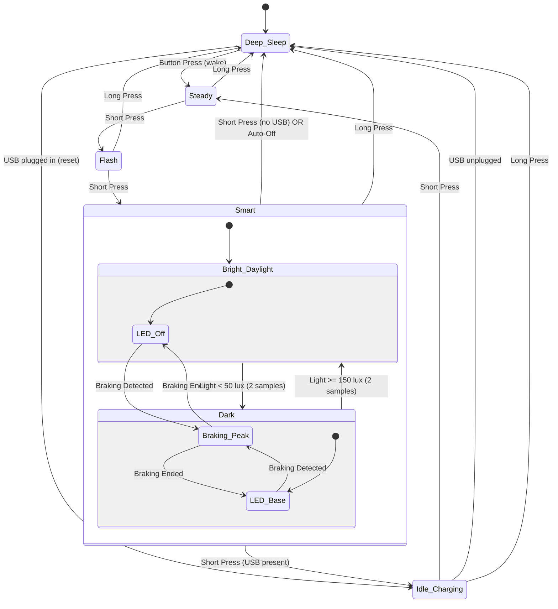

# Bike Light Rear - User Manual

## Overview

The bike light rear is a high-visibility intelligent bicycle tail light featuring three light modes (Steady, Flash, Smart), smart braking detection, ambient light sensing, and automatic power-saving functionality.

## Operating Modes

The light steps through its modes via short button press:

```
Deep Sleep → Steady → Flash → Smart → Deep Sleep
```

The three light modes (Steady, Flash, Smart) are the **Active Modes**. After the last one, a short press enters Deep Sleep, or Idle Charging when USB power is present (see below).

### Deep Sleep
- **Description**: Light is completely off; the device is in deep sleep (System OFF)
- **Power Consumption**: Minimal (only the button wake circuit is active)
- **Wake**: Press the button to wake; the light starts in Steady
- **Bluetooth**: Not reachable while in Deep Sleep

### Steady
- **Description**: Steady illumination at base brightness
- **PWM Frequency**: 1 kHz
- **Duty Cycle**: 20% (200µs pulse width)
- **Use Case**: General visibility in moderate traffic
- **Activation**: Press button from Deep Sleep (wake)

### Flash (High Visibility)
- **Description**: Enhanced visibility mode with a periodic double flash
- **Base Brightness**: 200µs pulse width (20% duty), continuous
- **Flash Pattern**: Double flash every 1.5 seconds - peak (800µs, 80% duty) for 70ms, base for 70ms, peak for 70ms, then back to base. The first double flash comes 1.5 seconds after entering the mode.
- **PWM Frequency**: 1 kHz
- **Use Case**: High-traffic environments, increased attention-grabbing
- **Activation**: Press button from Steady

### Smart (Adaptive)
- **Description**: Intelligent adaptive lighting based on environmental conditions and rider behavior
- **Features**:
  - Automatic braking detection
  - Ambient light sensing
  - Automatic power-off when stationary
- **Activation**: Press button from Flash
- **See detailed behavior below**

### Off (Bluetooth only)

The light can also be put into **Off** over Bluetooth: the light is dark but the device stays awake and connectable. Off is never entered with the button. A short press in Off starts the first light mode (Steady). Off has no timeout.

### Button behavior summary

- **Short press** (released within 1 second):
  - Steps through the light modes: `Steady → Flash → Smart`
  - After the last light mode (Smart), the light enters **Deep Sleep**, or **Idle Charging** when USB power is present. A short press in Idle Charging (or in Off) starts the first light mode again (Steady).
- **Long press** (held for 1 second or longer):
  - Turns the light **off immediately from any mode** (including with USB power present) and enters Deep Sleep. It acts at the 1 second mark; you do not have to release first.
- **Wake from sleep**:
  - After the light has turned itself fully off and entered Deep Sleep, a press wakes it and starts in Steady. The wake press does nothing else; keep holding it and nothing more happens, and the next press counts as a new press.

## Smart Mode Detailed Behavior

Smart adapts LED brightness based on three environmental factors.
Brightness priority: **Braking (Peak, 800µs) > Darkness (Base, 200µs) > Off**.

When Smart starts, the LED is off until the first dark detection (about one second in the dark).

### 1. Braking Detection

**Detection Criteria:**
- Z-axis acceleration < -3.0 m/s² for **2 consecutive samples** (1 second total)
- Rear-facing sensor orientation: negative Z indicates deceleration

**Behavior When Braking:**
- LED immediately switches to **Peak brightness** (800µs PWM)
- Overrides ambient light settings

**Braking End Detection:**
- Z-axis acceleration returns above -3.0 m/s² for **2 consecutive samples**
- LED returns to the brightness dictated by ambient light

### 2. Ambient Light Control

- **Darkness threshold**: < 50 lux for 2 consecutive samples → LED at base brightness
- **Brightness threshold**: ≥ 150 lux for 2 consecutive samples → LED off (hysteresis prevents flicker from the light's own output)

### 3. Automatic Power-Off

**Stationary Detection:**
- Monitors acceleration magnitude: √(x² + y² + z²)
- Expected value when stationary: ~9.81 m/s² (Earth's gravity)
- Tolerance: ±10% (8.829 - 10.791 m/s²)

**Auto-Off Criteria:**
- **300 consecutive samples** (2.5 minutes at 500ms sampling) within the stationary range
- Any sample outside the range (road vibration, movement) resets the counter
- Only active in Smart

**When Auto-Off Triggers:**
- Light switches off and enters Deep Sleep to save battery, also when USB power is present.
- Requires a manual button press to wake and reactivate (starts in Steady).

### Sensor failure

If a sensor does not start, Smart keeps working with the other one. Without the light sensor the LED stays off. Without the accelerometer there is no braking boost and no auto-off.

## Charging & Battery Behavior

### Normal charging

- **USB-C port** on the light is used for charging the 18350 cell. Charging is done by autonomous hardware, also while the light is in Deep Sleep.
- Powering up (or plugging in USB while in Deep Sleep) with **USB power** boots the light into **Idle Charging** (main LED off).
- **Plugging in USB while the light is on never changes the mode**, so the light stays on, for example if a power bank is connected mid-ride. Only the status LED changes.
- While USB power is present, the **status LED blinks fast (300ms)** to show charging activity, in every awake state.
- **Unplugging USB** while in Idle Charging powers the light off (Deep Sleep); press the button to turn it back on.

### Low-battery indication and shut-off

- Battery voltage is sampled every 5 seconds in all modes.
- **Low battery** (below ~3.4V for 3 consecutive samples): the status LED blinks slowly (500ms) to signal that a recharge is due. Recovers automatically when the voltage stays at or above 3.4V. **The status LED is the only low-battery warning**: it is meant to be seen by the rider, and the main light is not changed in any way until the battery is critical.
- **Critical battery** (below ~3.0V for 3 consecutive samples): the light turns off and enters Deep Sleep to protect the cell.
- To use the light again, **recharge the battery** and press the button to wake it. Waking with a critical battery turns the light on briefly until the critical shut-off triggers again.
- Battery readings are not reliable while USB power is present.

### Status LED priority

1. Low battery → 500ms blink
2. Charging (USB power present) → 300ms blink
3. Light in an active mode → solid on
4. Otherwise → off

## Technical Specifications

### Sensor System

**Accelerometer (LIS3DH):**
- 3-axis motion detection
- Sampling Rate: 500ms (2 Hz), only while in Smart
- Range: ±2g typical
- Interface: I²C

**Light Sensor (OPT3001):**
- Range: 0.01 - 83,000 lux
- Human-eye spectral matching
- Sampling Rate: 500ms (2 Hz), only while in Smart
- Interface: I²C

### LED Driver

**LED Specifications:**
- Type: Cree XP-E2 Red (625nm)
- Drive Current: 500mA
- Driver: PAM2804 constant-current step-down

**PWM Control:**
- Frequency: 1 kHz (1000µs period)
- Resolution: 1µs
- Brightness Levels:
  - Off: 0µs pulse width
  - Base: 200µs pulse width (20% duty)
  - Peak (braking/flash): 800µs pulse width (80% duty)

### Power Management

**Battery:**
- Type: Single 18350 Li-ion cell
- Capacity: 1100mAh (Vapcell)
- Operating Range: 3.11V - 4.2V

**System Voltage:**
- Regulated: 2.7V (NPM1100 buck regulator)
- Efficiency: 90-95% battery utilization

**Protection:**
- Over-voltage: 4.3V cutoff
- Under-voltage: 2.5V cutoff (DW01A protection IC)
- Over-current: >2A protection

**Battery Measurement:**
- SAADC on AIN5 through a 1M/100k divider, sampled every 5 seconds

## State Transition Diagram



"Steady → Flash → Smart" is the configured mode order. A different order changes the arrows between the light modes, but Idle Charging (or Deep Sleep) always follows the last one. Off (Bluetooth only) is not shown.

## Usage Recommendations

### Daytime Riding
- Use **Flash** mode for maximum visibility in bright conditions
- Or use **Smart** which will activate only during braking

### Night Riding
- Use **Steady** for steady visibility
- Or use **Smart** which provides the base brightness with braking boost

### Commuting
- **Smart** is ideal for mixed urban/traffic conditions
- Automatic brightness adjustment reduces manual intervention
- Auto-off prevents battery drain if bike is left stationary

## Optional Bluetooth Control (for advanced users)

The rear light includes a simple Bluetooth Low Energy (BLE) interface. It is available whenever the device is awake (not in Deep Sleep), supports one connection at a time, and is **not authenticated**: any device in range can change the mode.

- Service UUID `0xA000` (advertised)
- Characteristic `0xA001` (read): current state as one byte (0=Off, 1=Steady, 2=Flash, 3=Smart, 4=Idle Charging)
- Characteristic `0xA002` (write): requested state as one byte. Valid requests are 0 (Off), 1 (Steady), 2 (Flash), 3 (Smart). Idle Charging (4) cannot be requested; it is set only by USB power. Invalid requests are ignored.
- A write always reports success, even when the request is ignored. Read `0xA001` to see the result.
- Remote mode changes are ignored for 3 seconds after any local mode change (and after boot), so a connected device cannot fight a just-pressed button.
- A BLE-written Off keeps the device awake and connectable; only the button and the safety features enter Deep Sleep.
- Button presses and safety features (braking, auto-off, low battery) always take priority over BLE control.

For developers or integrators who want to use BLE control, see `src/ble.c` in the firmware source.

## Firmware Information

**Build System:** nRF Connect SDK v3.1.1
**Target Device:** Nordic nRF52833 (BL653 module)
**RTOS:** Zephyr OS
**Programming Interface:** SWD (Serial Wire Debug)

**Software Architecture:**
- Event-driven central state machine: every input (button, BLE write, battery tick, USB plug/unplug, sensor detections) is posted as an event into one message queue
- Main thread runs the state machine event loop and is the only writer of system state and light output
- Sensor thread: 500ms sampling in Smart, posts edge events (brake start/stop, dark/bright, stationary timeout)
- Timer ISRs and BLE callbacks only post events - no state is modified outside the state machine thread
- If the main LED, status LED or button fails to initialize at boot, the firmware resets instead of stopping
- There is no watchdog

**Key Configuration Options:**
- `BRAKING_ACCEL_THRESHOLD_MILLI`: -3000 milli-m/s² (in `src/sensors.c`)
- `AMBIENT_DARK_THRESHOLD_MILLILUX` / `AMBIENT_BRIGHT_THRESHOLD_MILLILUX`: 50 / 150 lux (in `src/sensors.c`)
- `STATIONARY_SAMPLES`: 300 samples = 2.5 minutes (in `src/sensors.c`)
- `BATTERY_CRITICAL_MV` / `BATTERY_LOW_MV`: 3000 / 3400 mV (in `src/battery.c`)
- `LIGHT_PULSE_BASE` / `LIGHT_PULSE_PEAK`: 200 / 800 µs (in `inc/light.h`)

See `SPEC.md` for the full behavioural specification and `CONTEXT.md` for the terminology.

## License

Copyright © 2025 Matthias Dippold

This firmware is released under **GPLv3 + NonCommercial**.
See LICENSE file for complete terms.

---

**Firmware Version:** 2.0.0 (Event-Driven State Machine Rebuild)
**Last Updated:** October 2026
**For support and updates:** See main README.md
